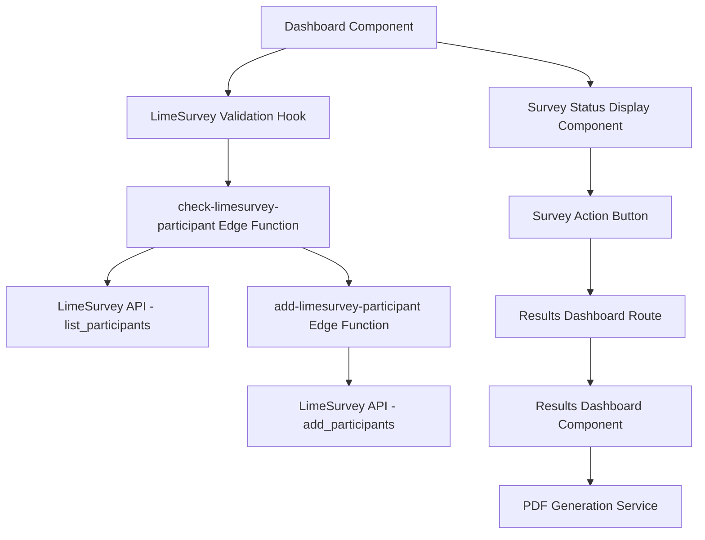
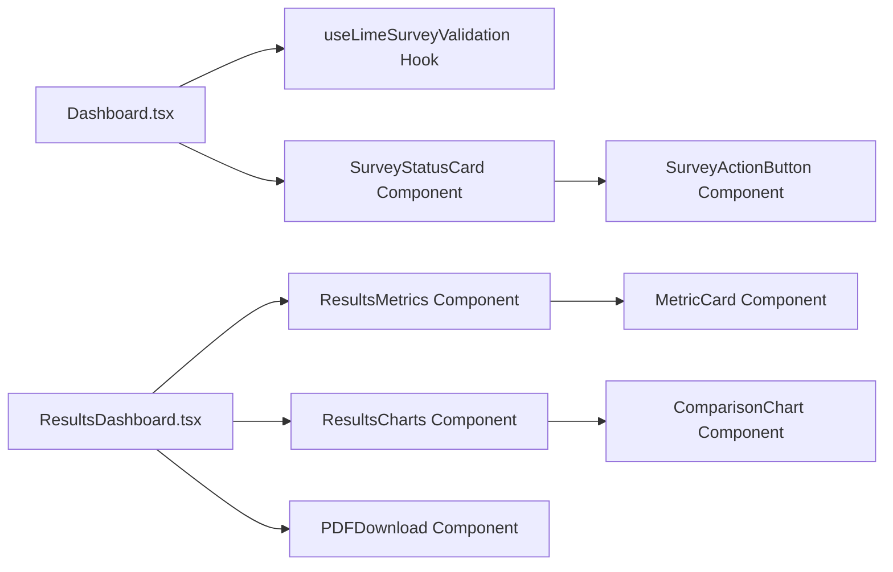

# Design Document

## Overview

Este diseño implementa un sistema de validación de estado de participación en encuestas de LimeSurvey que se integra directamente en el dashboard existente. El sistema reemplaza la validación actual basada en la tabla `limesurvey_participants` de Supabase por consultas directas a la API de LimeSurvey usando el método `list_participants`. Incluye un dashboard de resultados con datos artificiales y funcionalidad de descarga de PDF.

## Architecture

### High-Level Architecture



### Component Architecture



## Components and Interfaces

### 1. Custom Hook: useLimeSurveyValidation

**Purpose:** Maneja la lógica de validación del estado de participación en LimeSurvey

**Interface:**
```typescript
interface LimeSurveyParticipantStatus {
  status: 'loading' | 'not_found' | 'pending' | 'completed' | 'error'
  completedDate?: string
  usesLeft?: number
  error?: string
}

interface UseLimeSurveyValidationReturn {
  participantStatus: LimeSurveyParticipantStatus
  checkParticipantStatus: () => Promise<void>
  isLoading: boolean
}

function useLimeSurveyValidation(userId: string): UseLimeSurveyValidationReturn
```

**Responsibilities:**
- Llamar a la Edge Function `check-limesurvey-participant`
- Procesar la respuesta y determinar el estado del participante
- Manejar errores y reintentos
- Proporcionar estado de carga

### 2. Component: SurveyStatusCard

**Purpose:** Muestra el estado actual de la participación del usuario en la encuesta

**Props Interface:**
```typescript
interface SurveyStatusCardProps {
  participantStatus: LimeSurveyParticipantStatus
  onActionClick: () => void
  isProcessing?: boolean
}
```

**Responsibilities:**
- Renderizar diferentes estados visuales según el status
- Mostrar información relevante (fecha de completado, usos restantes)
- Proporcionar botones de acción apropiados

### 3. Component: SurveyActionButton

**Purpose:** Botón dinámico que cambia según el estado de participación

**Props Interface:**
```typescript
interface SurveyActionButtonProps {
  status: LimeSurveyParticipantStatus['status']
  onClick: () => void
  isLoading?: boolean
}
```

**States:**
- `not_found`: "Iniciar Diagnóstico" → registra y navega a encuesta
- `pending`: "Continuar Encuesta" → navega a encuesta
- `completed`: "Ver Resultados" → navega a dashboard de resultados

### 4. Page: ResultsDashboard

**Purpose:** Dashboard de resultados con datos artificiales y comparaciones

**Route:** `/dashboard/resultados`

**Components:**
- Header con información del usuario y fecha de completado
- Grid de métricas individuales vs promedio
- Gráficos de comparación
- Botón de descarga de PDF

### 5. Component: ResultsMetrics

**Purpose:** Muestra métricas individuales comparadas con promedios

**Data Structure:**
```typescript
interface Metric {
  id: string
  name: string
  description: string
  userValue: number
  averageValue: number
  maxValue: number
  unit: string
  category: string
}

interface MetricsData {
  categories: string[]
  metrics: Metric[]
  overallScore: {
    user: number
    average: number
  }
}
```

### 6. Service: PDFGenerationService

**Purpose:** Genera reportes PDF con los resultados del usuario

**Interface:**
```typescript
interface PDFGenerationService {
  generateResultsPDF(
    userData: UserProfile,
    metricsData: MetricsData,
    completedDate: string
  ): Promise<Blob>
}
```

## Data Models

### LimeSurvey API Response Models

```typescript
// Respuesta cuando no se encuentra participante
interface NoParticipantResponse {
  id: number
  result: {
    status: "No survey participants found."
  }
  error: null
}

// Respuesta cuando se encuentra participante
interface ParticipantFoundResponse {
  id: number
  result: Array<{
    tid: number
    token: string
    participant_info: {
      firstname: string
      lastname: string
      email: string
    }
    completed: string | "N" // Fecha o "N"
    usesleft: number
  }>
  error: null
}

// Respuesta de error
interface ErrorResponse {
  id: number
  result: null
  error: {
    message: string
    code?: number
  }
}
```

### Artificial Results Data Model

```typescript
interface ArtificialResultsData {
  user: {
    id: string
    name: string
    company: string
    completedDate: string
  }
  dimensions: Array<{
    id: string
    name: string
    description: string
    userScore: number
    averageScore: number
    maxScore: number
    questions: Array<{
      id: string
      text: string
      userAnswer: number
      averageAnswer: number
    }>
  }>
  overallMetrics: {
    totalScore: number
    averageTotalScore: number
    percentile: number
    strongAreas: string[]
    improvementAreas: string[]
  }
}
```

## Error Handling

### Edge Function Error Handling

```typescript
interface EdgeFunctionError {
  type: 'network' | 'limesurvey_api' | 'authentication' | 'validation'
  message: string
  code?: string
  retryable: boolean
}
```

**Error Scenarios:**
1. **Network Errors:** Timeout, connection issues
2. **LimeSurvey API Errors:** Invalid session, API down
3. **Authentication Errors:** Invalid user, expired session
4. **Validation Errors:** Invalid parameters, malformed response

**Error Recovery:**
- Automatic retry for network errors (max 3 attempts)
- Fallback to cached data when available
- Graceful degradation - show basic dashboard without LimeSurvey integration
- User-initiated retry option

### Frontend Error Handling

```typescript
interface ErrorState {
  hasError: boolean
  error?: EdgeFunctionError
  canRetry: boolean
}
```

**Error Display:**
- Toast notifications for temporary errors
- Inline error messages for persistent issues
- Retry buttons for recoverable errors
- Fallback content when LimeSurvey is unavailable

## Testing Strategy

### Unit Tests

**Components to Test:**
1. `useLimeSurveyValidation` hook
   - Different API response scenarios
   - Error handling and retry logic
   - Loading states

2. `SurveyStatusCard` component
   - Rendering for each status type
   - Button interactions
   - Error state display

3. `ResultsDashboard` components
   - Data visualization accuracy
   - PDF generation functionality
   - Responsive design

### Integration Tests

**Scenarios to Test:**
1. **Complete User Flow:**
   - New user → registration → survey completion → results viewing
   - Existing user with pending survey
   - Existing user with completed survey

2. **Edge Function Integration:**
   - Mock LimeSurvey API responses
   - Error scenarios and recovery
   - Authentication flow

3. **PDF Generation:**
   - Content accuracy
   - File download functionality
   - Different data scenarios

### E2E Tests

**Critical Paths:**
1. Dashboard load → participant check → appropriate action
2. Survey completion → results dashboard → PDF download
3. Error scenarios → user recovery actions

## Implementation Phases

### Phase 1: Core Infrastructure
- Create `check-limesurvey-participant` Edge Function
- Implement `useLimeSurveyValidation` hook
- Update Dashboard component with new validation logic

### Phase 2: Status Display
- Create `SurveyStatusCard` component
- Implement dynamic action buttons
- Add error handling and retry mechanisms

### Phase 3: Results Dashboard
- Create results dashboard route and components
- Implement artificial data generation
- Add basic visualization components

### Phase 4: PDF Generation
- Implement PDF generation service
- Add download functionality
- Optimize PDF layout and content

### Phase 5: Testing and Polish
- Comprehensive testing suite
- Performance optimization
- Error handling refinement
- User experience improvements

## Security Considerations

### API Security
- LimeSurvey credentials stored as environment variables
- Session key management with automatic cleanup
- Input validation for all user-provided data

### Data Privacy
- User data only used for survey participation
- No sensitive data stored in artificial results
- PDF generation happens client-side when possible

### Authentication
- All Edge Function calls require valid Supabase auth
- User ID validation before API calls
- Proper error messages without exposing internal details

## Performance Considerations

### Optimization Strategies
- Cache LimeSurvey session keys for short periods
- Lazy load results dashboard components
- Optimize PDF generation for large datasets
- Implement proper loading states

### Monitoring
- Edge Function execution time tracking
- LimeSurvey API response time monitoring
- Error rate tracking and alerting
- User experience metrics (time to interactive)

## Migration Strategy

### Backward Compatibility
- Keep existing `limesurvey_participants` table for reference
- Gradual migration from table-based to API-based validation
- Fallback to table data if API is unavailable

### Deployment Plan
1. Deploy Edge Functions first
2. Update frontend components with feature flags
3. Test with subset of users
4. Full rollout with monitoring
5. Remove old table-based logic after validation period