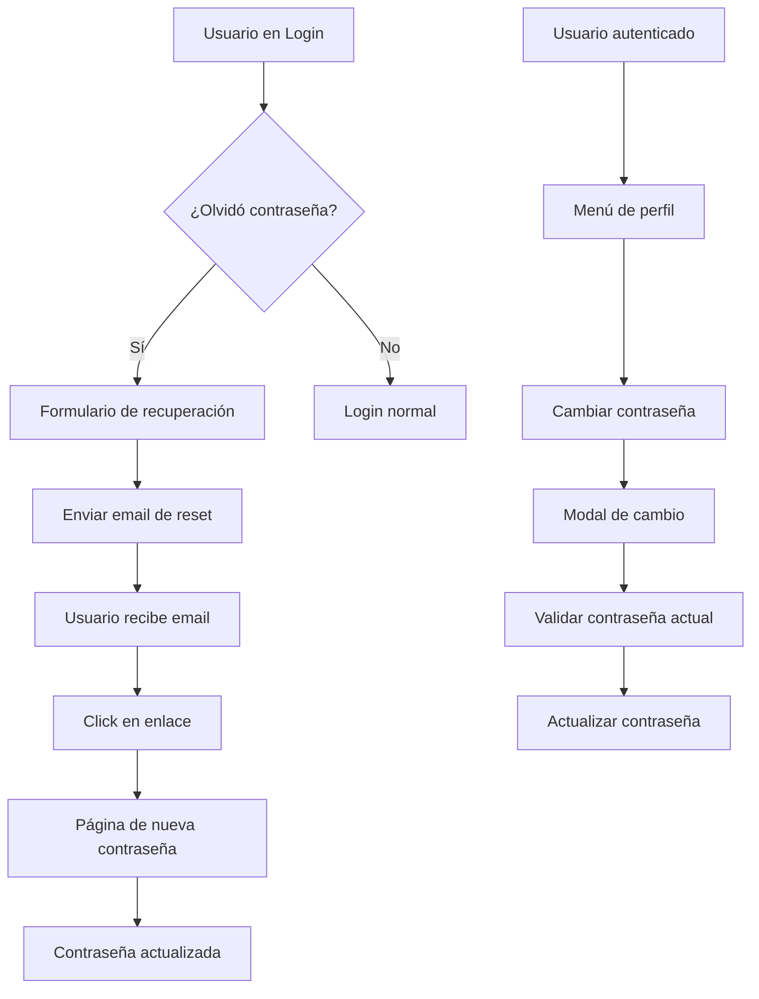

# Design Document

## Overview

Este diseño implementa un sistema completo de gestión de contraseñas para la aplicación existente que utiliza Supabase como backend. La funcionalidad incluye cambio de contraseña para usuarios autenticados, recuperación de contraseña para usuarios que han olvidado sus credenciales, y una actualización del header del dashboard para incluir el logo de Bi-Data. El diseño mantiene la consistencia visual con la paleta de colores bidata-* existente y sigue las mejores prácticas de UX/UI.

## Architecture

### Component Structure

```
src/
├── components/
│   ├── auth/
│   │   ├── ChangePasswordModal.tsx     # Modal para cambio de contraseña
│   │   └── ForgotPasswordForm.tsx      # Formulario de recuperación
│   ├── layout/
│   │   └── Header.tsx                  # Header actualizado con logo
│   └── ui/                             # Componentes UI existentes
├── pages/
│   ├── LoginPage.tsx                   # Página de login actualizada
│   ├── ResetPasswordPage.tsx           # Nueva página para reset
│   └── Dashboard.tsx                   # Dashboard existente
├── hooks/
│   └── useAuth.ts                      # Hook de autenticación actualizado
└── contexts/
    └── AuthContext.tsx                 # Contexto existente
```

### Authentication Flow



## Components and Interfaces

### 1. ChangePasswordModal Component

**Props Interface:**
```typescript
interface ChangePasswordModalProps {
  isOpen: boolean
  onClose: () => void
}
```

**Features:**
- Modal overlay con formulario de cambio de contraseña
- Validación de contraseña actual
- Validación de nueva contraseña (mínimo 6 caracteres)
- Confirmación de nueva contraseña
- Estados de loading y error
- Integración con Supabase Auth
- Diseño consistente con paleta bidata-*

### 2. ForgotPasswordForm Component

**Props Interface:**
```typescript
interface ForgotPasswordFormProps {
  onSuccess: () => void
  onCancel: () => void
}
```

**Features:**
- Formulario para ingresar email
- Validación de email
- Envío de email de recuperación via Supabase
- Estados de loading y confirmación
- Navegación de regreso al login

### 3. ResetPasswordPage Component

**Features:**
- Página completa para establecer nueva contraseña
- Extracción de token de URL
- Validación de nueva contraseña
- Confirmación de contraseña
- Redirección automática después del éxito
- Manejo de tokens expirados o inválidos

### 4. Updated Header Component

**Features:**
- Logo de Bi-Data en la izquierda
- Menú de perfil en la derecha
- Responsive design
- Integración con modal de cambio de contraseña
- Mantiene funcionalidad existente de logout

### 5. Updated LoginPage Component

**Features:**
- Enlace "¿Olvidaste tu contraseña?" debajo del formulario
- Integración con ForgotPasswordForm
- Estados de navegación entre login y recuperación
- Mantiene diseño existente

## Data Models

### Password Change Request
```typescript
interface PasswordChangeRequest {
  currentPassword: string
  newPassword: string
  confirmPassword: string
}
```

### Password Reset Request
```typescript
interface PasswordResetRequest {
  email: string
}
```

### Password Reset Confirmation
```typescript
interface PasswordResetConfirmation {
  token: string
  newPassword: string
  confirmPassword: string
}
```

## Error Handling

### Error Types
```typescript
enum PasswordErrorType {
  INVALID_CURRENT_PASSWORD = 'invalid_current_password',
  WEAK_PASSWORD = 'weak_password',
  PASSWORD_MISMATCH = 'password_mismatch',
  INVALID_TOKEN = 'invalid_token',
  EXPIRED_TOKEN = 'expired_token',
  EMAIL_NOT_FOUND = 'email_not_found',
  NETWORK_ERROR = 'network_error'
}
```

### Error Messages (Español)
```typescript
const errorMessages = {
  invalid_current_password: 'La contraseña actual es incorrecta',
  weak_password: 'La contraseña debe tener al menos 6 caracteres',
  password_mismatch: 'Las contraseñas no coinciden',
  invalid_token: 'El enlace de recuperación es inválido',
  expired_token: 'El enlace de recuperación ha expirado',
  email_not_found: 'No se encontró una cuenta con este email',
  network_error: 'Error de conexión. Intente nuevamente'
}
```

## Testing Strategy

### Unit Tests
- Validación de formularios
- Manejo de estados de loading
- Transformación de errores de Supabase
- Navegación entre componentes

### Integration Tests
- Flujo completo de cambio de contraseña
- Flujo completo de recuperación de contraseña
- Integración con Supabase Auth
- Persistencia de sesión después del cambio

### E2E Tests
- Usuario cambia contraseña exitosamente
- Usuario recupera contraseña olvidada
- Manejo de tokens expirados
- Responsive design en diferentes dispositivos

## Supabase Integration

### Auth Methods Used
```typescript
// Cambio de contraseña
supabase.auth.updateUser({ password: newPassword })

// Solicitud de recuperación
supabase.auth.resetPasswordForEmail(email, {
  redirectTo: `${window.location.origin}/reset-password`
})

// Verificación de token de reset
supabase.auth.verifyOtp({
  token_hash: tokenHash,
  type: 'recovery'
})
```

### Email Templates
- Utiliza el template de recuperación existente de Supabase
- Configuración de redirect URL para la página de reset
- Personalización del template si es necesario

## Visual Design

### Color Scheme (Existing bidata-* palette)
```css
/* Colores principales */
bidata-cyan: #00BCD4
bidata-dark: #333333
bidata-gray: #666666

/* Estados */
success: #4CAF50
warning: #FF9800
danger: #F44336
```

### Component Styling
- Modal con backdrop semi-transparente
- Formularios con bordes redondeados
- Botones con efectos hover y estados disabled
- Iconos de Lucide React consistentes
- Animaciones suaves para transiciones

### Logo Integration
- Logo de Bi-Data en formato SVG o PNG optimizado
- Posicionamiento en la izquierda del header
- Altura máxima de 40px para mantener proporciones
- Responsive behavior en móviles

## Security Considerations

### Password Validation
- Mínimo 6 caracteres (configurable)
- Validación en frontend y backend
- No almacenamiento de contraseñas en localStorage

### Token Handling
- Tokens de recuperación con expiración automática
- Validación de tokens en el servidor
- Limpieza de tokens después del uso

### Rate Limiting
- Utiliza los límites de Supabase para envío de emails
- Prevención de spam en formularios de recuperación

## Performance Considerations

### Code Splitting
- Modal de cambio de contraseña cargado dinámicamente
- Página de reset como ruta separada

### Caching
- Reutilización de componentes UI existentes
- Optimización de re-renders con React.memo

### Bundle Size
- Reutilización de dependencias existentes (Lucide React, shadcn/ui)
- No agregación de librerías adicionales

## Accessibility

### Keyboard Navigation
- Navegación completa por teclado en modales
- Focus management apropiado
- Escape key para cerrar modales

### Screen Readers
- Labels apropiados en formularios
- Mensajes de error anunciados
- Estados de loading comunicados

### Visual Indicators
- Contraste adecuado en todos los elementos
- Estados de focus visibles
- Iconos con texto alternativo